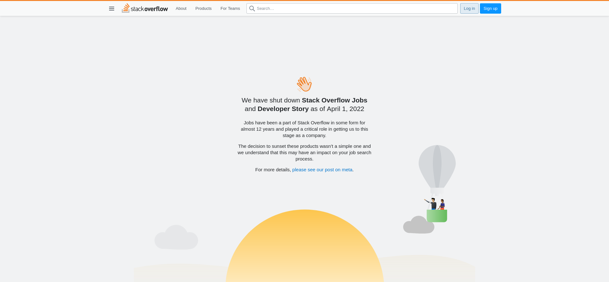
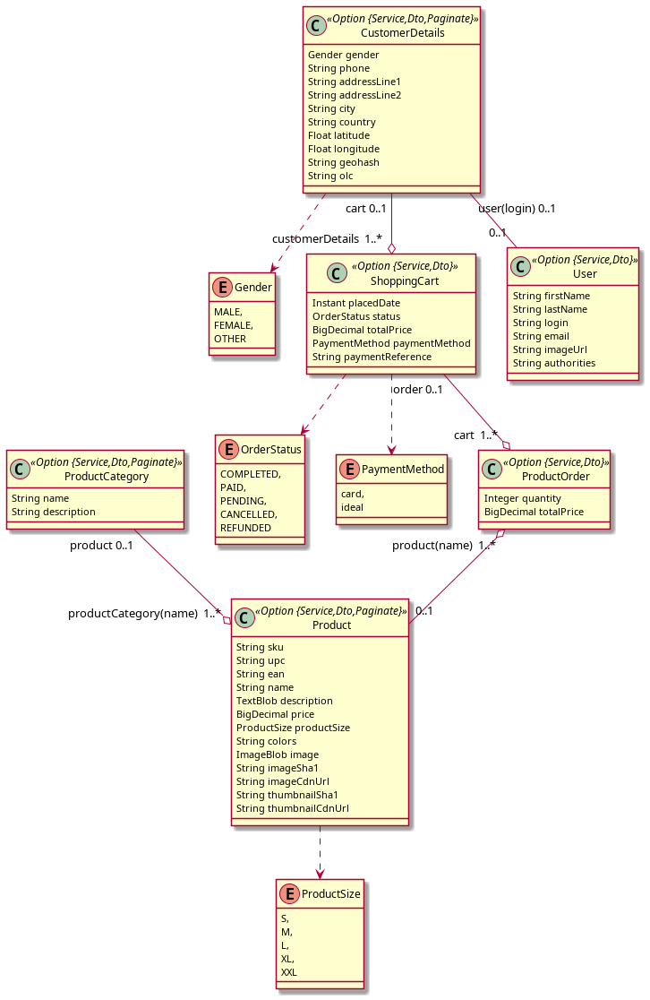

<!--
PDF output generated with
pandoc -f markdown -t pdf Notes.md -o 2023-01-23-report-Goepp.pdf
 -->

# Introduction

This lab was supervised by Didier Donsez. The related instructions are in [tutorial_en](https://github.com/mastering-microservices/tutorial_en), found from the [class's website](https://m2-mosig-cloud.gitlab.io/lectures/).

This report is written in a double purpose. On the one hand, as a fulfilment of the assignment. On the other hand, as notes for my future self, when I will have to deploy microservices on my own, either in the industry or in academia. When I mention roadblocks, I hope for the information to be useful for the latter purpose.

<!-- 
Location of the code : `~/Code/mastering-microservices/tutorial_en`
-->

<!--
## Remarks

The scope seems too broad to let us understand what is happening. I can imagine three approaches:

1. give more context, meta-information, to the students so they understand what they are actually doing and where they are going;
2. go with a more simple example, with less of the tooling and its brittleness;
3. embrace the chaos and use docker to provide reusable development/deployment environment, but giving the students less (maybe not so much) scope to understand what they are doing.
-->

# Monolithic application (`./monolith/README.md`)

## Creating a monolith (`monolith.md`)

### Creating the app

`ls -al .jhipster` lead to an error. There is indeed no such file nor directory.

```shell
~/Code/mastering-microservices/online-store$ cloc src/ webpack/
     476 text files.
     471 unique files.
      27 files ignored.

github.com/AlDanial/cloc v 1.94  T=0.39 s (1215.8 files/s, 72050.0 lines/s)
```

Formatted output of this command:

| Language     | files | blank | comment | code |
| ------------ | ----- | ----- | ------- | ---- |
| TypeScript   | 201   | 1385  | 561     | 7327 |
| Java         | 103   | 1231  | 606     | 6131 |
| JSON         | 63    | 0     | 0       | 5805 |
| HTML         | 45    | 250   | 22      | 2487 |
| YAML         | 18    | 43    | 295     | 545  |
| SCSS         | 8     | 56    | 73      | 280  |
| XML          | 6     | 33    | 39      | 237  |
| CSS          | 1     | 2     | 0       | 150  |
| JavaScript   | 3     | 12    | 20      | 129  |
| Properties   | 11    | 12    | 25      | 75   |
| Bourne Shell | 1     | 6     | 4       | 29   |
| Text         | 2     | 3     | 0       | 17   |
| CSV          | 3     | 0     | 0       | 10   |
| Cucumber     | 1     | 1     | 0       | 5    |
| SVG          | 4     | 0     | 0       | 4    |
| Markdown     | 1     | 0     | 0       | 1    |
|              |       |       |         |      |
| SUM:         | 471   | 3034  | 1645    | 3232 |


```
~/Code/mastering-microservices/online-store$ cloc src/ webpack/ *.json *.xml
     484 text files.
     479 unique files.
      27 files ignored.

github.com/AlDanial/cloc v 1.94  T=0.53 s (901.4 files/s, 100088.5 lines/s)
```

Formatted output of this command:

| Language     | files | blank | comment | code  |
| ------------ | ----- | ----- | ------- | ----- |
| JSON         | 70    | 0     | 0       | 31060 |
| TypeScript   | 201   | 1385  | 561     | 7327  |
| Java         | 103   | 1231  | 606     | 6131  |
| HTML         | 45    | 250   | 22      | 2487  |
| YAML         | 18    | 43    | 295     | 545   |
| SCSS         | 8     | 56    | 73      | 280   |
| XML          | 7     | 34    | 47      | 247   |
| CSS          | 1     | 2     | 0       | 150   |
| JavaScript   | 3     | 12    | 20      | 129   |
| Properties   | 11    | 12    | 25      | 75    |
| Bourne Shell | 1     | 6     | 4       | 29    |
| Text         | 2     | 3     | 0       | 17    |
| CSV          | 3     | 0     | 0       | 10    |
| Cucumber     | 1     | 1     | 0       | 5     |
| SVG          | 4     | 0     | 0       | 4     |
| Markdown     | 1     | 0     | 0       | 1     |
|              |       |       |         |       |
| SUM:         | 479   | 3035  | 1653    | 48497 |

Estimate the cost and the time for coding the basic application:

- https://stackoverflow.com/jobs/salary is offline (Figure 1)
  
  
- [Cocomo calculator](http://softwarecost.org/tools/COCOMO/): Based on 48497 being the total number of lines of code, and on a total employer cost of 4800 €/month/employee, the total cost for this piece of software could be estimated to be **1 007 788 €, for 21 months of time**. 

We are very fortunate not to have to write this on our own.

Swagger API exploration: http://localhost:8080/admin/docs

### Generate the entities and the relationships

The schema we have (`./online-store.jh`) does not match the one we are given a screenshot of. Instead, it matches the picture `online-store.png` in Figure 2. It might cause problems in later API calls.



```bash
~/Code/mastering-microservices/online-store$ cloc src/ webpack/
     706 text files.
     684 unique files.
      45 files ignored.

github.com/AlDanial/cloc v 1.94  T=1.58 s (433.0 files/s, 29565.5 lines/s)
```

Formatted output of this command:

| Language     | files | blank | comment | code  |
| ------------ | ----- | ----- | ------- | ----- |
| TypeScript   | 300   | 2675  | 1013    | 13810 |
| Java         | 158   | 2377  | 1484    | 11070 |
| JSON         | 82    | 0     | 0       | 6333  |
| HTML         | 65    | 401   | 22      | 4426  |
| XML          | 15    | 53    | 121     | 576   |
| YAML         | 18    | 43    | 295     | 545   |
| Scala        | 5     | 55    | 35      | 417   |
| SCSS         | 8     | 56    | 73      | 280   |
| CSS          | 1     | 2     | 0       | 150   |
| JavaScript   | 3     | 12    | 20      | 129   |
| Properties   | 11    | 12    | 26      | 75    |
| CSV          | 8     | 0     | 0       | 47    |
| Bourne Shell | 1     | 6     | 4       | 29    |
| Text         | 3     | 3     | 0       | 18    |
| Cucumber     | 1     | 1     | 0       | 5     |
| SVG          | 4     | 0     | 0       | 4     |
| Markdown     | 1     | 0     | 0       | 1     |
|              |       |       |         |       |
| SUM:         | 684   | 5696  | 3093    | 37915 |


Estimated cost and time to produce this amount of code: **18.4 months and 768 788 €**.

```bash
~/Code/mastering-microservices/online-store$ cloc src/ webpack/ *.json *.xml
     714 text files.
     692 unique files.
      45 files ignored.

github.com/AlDanial/cloc v 1.94  T=1.63 s (425.3 files/s, 44238.7 lines/s)
```

Formatted output of this command:

| Language     | files | blank | comment | code  |
| ------------ | ----- | ----- | ------- | ----- |
| JSON         | 89    | 0     | 0       | 31589 |
| TypeScript   | 300   | 2675  | 1013    | 13810 |
| Java         | 158   | 2377  | 1484    | 11070 |
| HTML         | 65    | 401   | 22      | 4426  |
| XML          | 16    | 54    | 129     | 586   |
| YAML         | 18    | 43    | 295     | 545   |
| Scala        | 5     | 55    | 35      | 417   |
| SCSS         | 8     | 56    | 73      | 280   |
| CSS          | 1     | 2     | 0       | 150   |
| JavaScript   | 3     | 12    | 20      | 129   |
| Properties   | 11    | 12    | 26      | 75    |
| CSV          | 8     | 0     | 0       | 47    |
| Bourne Shell | 1     | 6     | 4       | 29    |
| Text         | 3     | 3     | 0       | 18    |
| Cucumber     | 1     | 1     | 0       | 5     |
| SVG          | 4     | 0     | 0       | 4     |
| Markdown     | 1     | 0     | 0       | 1     |
|              |       |       |         |       |
| SUM:         | 692   | 5697  | 3101    | 63181 |


Estimate the new cost and the new time for coding the basic application : **1 348 011 € and 22 months**.

We run the application in `dev` profile:

```bash
./gradlew
```

to explore [the API](http://localhost:8080/admin/docs). We see many more operations, related to the new database tables that were introduced.

### Testing

The backend test **made my computer crash**. Skipping this.

### Code quality analysis with SonarQube

This section is optional.

I get the following errors from the sonarqube container.

```
store-sonar_1  | 2022.12.16 09:56:36 ERROR web[][o.s.s.es.BulkIndexer] index [rules], type [rule], id [AYUaXK9hz4Dx8_euD024], message [ElasticsearchException[Elasticsearch exception [type=cluster_block_exception, reason=index [rules] blocked by: [TOO_MANY_REQUESTS/12/disk usage exceeded flood-stage watermark, index has read-only-allow-delete block];]]]
store-sonar_1  | 2022.12.16 09:56:36 ERROR web[][o.s.s.es.BulkIndexer] index [rules], type [rule], id [AYUaXKB3z4Dx8_euDyVS], message [ElasticsearchException[Elasticsearch exception [type=cluster_block_exception, reason=index [rules] blocked by: [TOO_MANY_REQUESTS/12/disk usage exceeded flood-stage watermark, index has read-only-allow-delete block];]]]
```

The professor told me that SoarQube is not strictly required. Moving on.

<!-- ### CI/CD with Github actions

This section is optional.

### CI/CD with a local Jenkins server

This section is optional. -->

## Inspect the REST API (`restapi.md`)

Reaching the stage `# Operations on Product resource` of the big block of code to execute in a shell, I realised that my API did not seem to behave as expected.

I had to modify the content of the `PRODUCT` shell variable to this:

```bash
PRODUCT='{
  "name": "TEST",
  "description": "This is a test",
  "price": 5,
  "productSize": "XXL",
  "sku": "string",
  "upc": "string",
  "ean": "string",
  "productCategory": {
    "id": 1,
    "name": "firmware",
    "description": "Soft proactive front-end"
  }
}'
```

Note the presence of the extra *sku*, *upc* and *ean* fields, which are required as per the schema in `online-store.jh`. I also had to put one of the pre-existing category in `productCategory`. For us, it gives

```bash
PRODUCT_ID=10052
```

(because we already created other products through testing). Changing the price requires us to send the whole product again:

```bash
CHANGE='{
  "id": 1052,
  "name": "TEST",
  "description": "This is a test",
  "price": 1500,
  "productSize": "XXL",
  "sku": "string",
  "upc": "string",
  "ean": "string",
  "productCategory": {
    "id": 1,
    "name": "firmware",
    "description": "Soft proactive front-end"
  }
}'
${PUT} --header "$AUTH" --header "$CONTENT_JSON" ${URL}/api/products/${PRODUCT_ID} -d "$CHANGE"
```

### Generation of the REST clients and servers

This uses an old version of swagger-codegen-cli which is not compatible with our version of swagger (need version 3 instead of 2.4). I downloaded the right version of the tool, from [this URL](https://repo1.maven.org/maven2/io/swagger/codegen/v3/swagger-codegen-cli/3.0.20/swagger-codegen-cli-3.0.20.jar), and modified `codegen()` below.

```bash
codegen() {
  mkdir -p $1
  (cd $1;  java -jar ../swagger-codegen-cli-3.0.20.jar generate -i ../swagger.json -l $1)
}
```

### Generate the HTML documentation

There is a screenshot the API doc in Figure 3.


### Generate the clients

Number of generated lines of code (the total for the related folder, even in other languages):

| language   | files | comment | code  |
| ---------- | ----- | ------- | ----- |
| typescript | 31    | 1243    | 1547  |
| python     | 79    | 2990    | 7116  |
| php        | 77    | 8404    | 13886 |

Could not generate `cpprest`, as our version of the swagger code generator does not support this language. List of supported languages:

```
Available languages: [dart, aspnetcore, csharp, csharp-dotnet2, go, go-server,
    dynamic-html, html, html2, java, jaxrs-cxf-client, jaxrs-cxf, inflector,
    jaxrs-cxf-cdi, jaxrs-spec, jaxrs-jersey, jaxrs-di, jaxrs-resteasy-eap,
    jaxrs-resteasy, micronaut, spring, nodejs-server, openapi, openapi-yaml,
    kotlin-client, kotlin-server, php, python, python-flask, r, ruby, scala,
    scala-akka-http-server, swift3, swift4, swift5, typescript-angular,
    typescript-axios, typescript-fetch, javascript]
```

## Deploy locally with Docker (`deploy_docker.md`)

### Deploy locally the application with Docker

When we stop the PostgreSQL sever, the application still responds but we are logged out and it is impossible to login again. As soon as the PostgreSQL server is restarted, we can resume using the web application (provided we reload the page).

## Monitor the application (`monitor.md`)

Done. It required to comment the `ports` sections of the docker-compose file `monitoring.yml`. Outcome:

%20-%20Dashboards%20-%20Grafana.png)

## Load injection with Gatling (`gatling.md`)

As it is optional, we skip (time missing).

## Deploy in production on Heroku (`deploy_heroku.md`), and on Google App Engine (`deploy_gcp.md`)

I stopped the work on the monolithic version of the app here, choosing to focus on deploying and understanding the microservices one.

# Microservices-based application (`./miscroservices/README.md`)

## Generate the microservices architecture (`microservices.md`)

### Browse the application and service registry

```bash
open http://localhost:8080
open http://localhost:8761
```

> What can you see ?

In the API browser, only the registry's API shows. However, the gateway administration page shows all services. They are online but I do not know how to interact with them. We probably need to configure the gateway to interface with the services' APIs.

The registry also lists all services.

> What happens if one microservice is stopped (failure simulation ...)?

I stopped the 'invoice' service. The related entries in the gateway and registry webpages is removed upon refresh. There is nothing yet ensuring resilience to failures.

Just for illustration, here are screenshots of the registry (not all services up yet)


and the gateway's routes, showing the three services and registry


### Generation of the code of the microservice `notification`

Thanks to the modifications here, the gateway's API interface allows to browse all services's API. I took a screenshot of the productorder one. Nothing new in the registry.


### Build the Docker images

The new syntax for Gradle 8.0 to generate docker images (OCI) is:

```bash
./gradlew -Pprod bootJar assemble -x test
```

### Generation of the docker-compose files

The version of JHipster on my machine (v7.9.3) does not have the expected gateway

```
? Which *type* of gateway would you like to use? JHipster gateway based on Netflix Zuul
```

but instead offers `JHipster gateway ased on Spring Cloud Gateway` (only option). Likewise

```
? Do you want to setup monitoring for your applications ? Yes, for logs and metrics
    with the JHipster Console (based on ELK and Zipkin)
```

is replaced with `Yes, for metrics only with Prometheus`.

The following was displayed after genration:

```
WARNING! Docker Compose configuration generated, but no Jib cache found
If you forgot to generate the Docker image for this application, please run:
To generate the missing Docker image(s), please run:
  ./gradlew bootJar -Pprod jibDockerBuild in /home/dorian/Code/mastering-microservices/
      microservice/gateway
  ./gradlew bootJar -Pprod jibDockerBuild in /home/dorian/Code/mastering-microservices/
      microservice/invoice
  ./gradlew bootJar -Pprod jibDockerBuild in /home/dorian/Code/mastering-microservices/
      microservice/notification
  ./gradlew bootJar -Pprod jibDockerBuild in /home/dorian/Code/mastering-microservices/
      microservice/productorder
```

I failed to build the docker images before. These commands did work however. The images are now generated.

`docker-compose up` does start containers. However, the notification microservice does not start, as shown in screenshot.


It seems to come from an error showing in the logs:

```
notification-mongodb-config    | {"t":{"$date":"2023-01-21T16:39:10.028+00:00"},"s":"I",
    "c":"SHARDING", "id":22727, "ctx":"shard-registry-reload",
    "msg":"Error running periodic reload of shard registry","attr": {
        "error":"NotYetInitialized: could not get updated shard list from config server :: caused
        by :: Cannot use non-local read concern until replica set is finished initializing.",
        "shardRegistryReloadIntervalSeconds":30}
      }
notification-mongodb-config    | {"t":{"$date":"2023-01-21T16:39:10.035+00:00"},"s":"I",
    "c":"STORAGE", "id":22430, "ctx":"WTCheckpointThread",
    "msg":"WiredTiger message","attr": {
      "message":"[1674319150:35883][1:0x7f66600df700], WT_SESSION.checkpoint: 
        [WT_VERB_CHECKPOINT_PROGRESS] saving checkpoint snapshot min: 8,
        snapshot max: 8 snapshot count: 0, oldest timestamp: (0, 0) ,
        meta checkpoint timestamp: (0, 0) base write gen: 25"}
    }


notification-mongodb_1         | {"t":{"$date":"2023-01-21T16:39:10.651+00:00"},"s":"I",
    "c":"NETWORK", "id":4333208, "ctx":"ReplicaSetMonitor-TaskExecutor",
    "msg":"RSM host selection timeout", "attr": {
        "replicaSet":"csvr",
        "error":"FailedToSatisfyReadPreference: Could not find host matching read
        preference { mode: \"nearest\" } for set csvr"}
    }
```

My research for the cause was fruitless. It does not prevent the rest of the software from functioning so I can carry on. This indeed one of the features of well-design microservices architectures: failure of a component does not necessarily take down the whole application.

### Monitor the microservices : Prometheus and Grafana

It turns out that there are already a Graphana and a Prometheus instance running. They were generated with the rest of the containers and started by the former `docker-compose`. However, the sample Graphana dashboard is not there, and I did not manage to import it from other sources.

## Deploy in production the microservices on GCP with Kubernetes (`deploy_k8n.md`)

```bash
docker --version
kubectl version
```

outcome:

```
Docker version 20.10.22, build 3a2c30b
```

and

```
Client Version: v1.26.0
Kustomize Version: v4.5.7
Server Version: v1.24.8-gke.2000
WARNING: version difference between client (1.26) and server (1.24) exceeds the supported minor version skew of +/-1
```

Diverging answer to the questions in `jhipster kubernetes`:

```
? What should we use for the base Docker repository name? dogoepp
```

Here is the deployed software in Kubernetes Engine:


I took the care to change the default password for the gateway, as the application has been made available to the whole internet with a default password that is obvious to guess.

```
$ kubectl get svc
NAME         TYPE        CLUSTER-IP   EXTERNAL-IP   PORT(S)   AGE
kubernetes   ClusterIP   10.22.0.1    <none>        443/TCP   21h
```

```
$ kubectl get svc gateway -n store
NAME      TYPE           CLUSTER-IP    EXTERNAL-IP    PORT(S)          AGE
gateway   LoadBalancer   10.22.3.158   34.159.47.62   8080:31058/TCP   101m
```

This done, I could access the gateway at the above IP address and port 8080. The screenshot below shows the data entities that could be created, read, modified and deleted from the gateway, although they were hosted and made available through separate micro-services.


Here is a detailed view of the entry to the `notifications` table I added for testing, also showing the **IP address of the gateway** in the address bar.


We are asked to get the IP address of the console, but I do not have the related service running. These are all the services I have:

```
$ kubectl get svc -n store
NAME                      TYPE           CLUSTER-IP    EXTERNAL-IP    PORT(S)          AGE
gateway                   LoadBalancer   10.22.3.158   34.159.47.62   8080:31058/TCP   102m
gateway-postgresql        ClusterIP      10.22.3.186   <none>         5432/TCP         102m
invoice                   ClusterIP      10.22.2.46    <none>         8082/TCP         102m
invoice-mysql             ClusterIP      10.22.3.219   <none>         3306/TCP         102m
jhipster-registry         ClusterIP      None          <none>         8761/TCP         103m
notification              ClusterIP      10.22.2.92    <none>         8083/TCP         102m
notification-mongodb      ClusterIP      None          <none>         27017/TCP        102m
productorder              ClusterIP      10.22.2.255   <none>         8081/TCP         102m
productorder-postgresql   ClusterIP      10.22.1.254   <none>         5432/TCP         102m
```

It is probably because my Jhipster did not offer the ELK option on deployment's monitoring. It instead offered Prometheus and Grafana. But the latter never got started. It seems that the `./kubectl-apply.sh` script did not manage to start it. It would display `Waiting for the custom resource prometheus operator to get initialised` in a loop. Here is a more detailed error message displayed as part of a long stream of messages:

```
error: resource mapping not found for name: "gateway-app" namespace: "store" from "gateway-k8s/gateway-prometheus-sm.yml": no matches for kind "ServiceMonitor" in version "monitoring.coreos.com/v1"
ensure CRDs are installed first
```

And an excerpt of the shell output:


Exposing the service registry:

```
$ kubectl get svc exposed-registry -n $APPID
NAME               TYPE       CLUSTER-IP   EXTERNAL-IP   PORT(S)          AGE
exposed-registry   NodePort   10.22.0.73   <none>        8761:30790/TCP   8s
```

Once this was done, I took good care to stop or destroy all relevant resource in the Google Cloud console. I found that the most reliable way to ensure nothing will incur later costs was through the billing panel ("Facturation" in French). There, I disallowed billing of all Google Cloud projects. This prevents anything billable to run.

# Conclusion

This has been an epic journey discovering how modern web-development tools are used. It has been rewarding, and challenging.

Beyond what was taught in the lectures, this lab session taught me about the complexity of the tools related to micro-services and general cloud development. I also come with the impression that there is a lot of overhead, computational and memory cost, coming with these tools, probably as a cost of their powers. I hope and assume that these are offset by the features and developer support they provide when developing truly complex software, unlike the toy code we were using here.

As an illustration to the above, the whole folder for the tutorial and both monolithic and microservice versions of the application takes 5.1 GB of space on my computer.

As a personal note of improvement, I wish I had done all the development of the app within a container. I would have been more confident in the environment in which everything was being built. Besides, it might have spared me some of the issues faced above, especially those I could not fix.